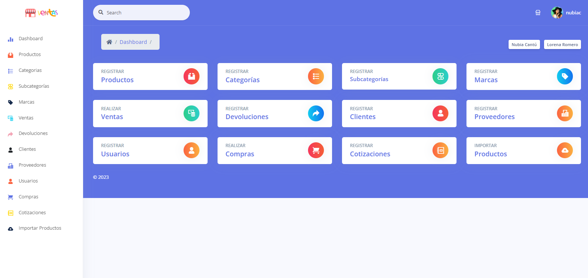
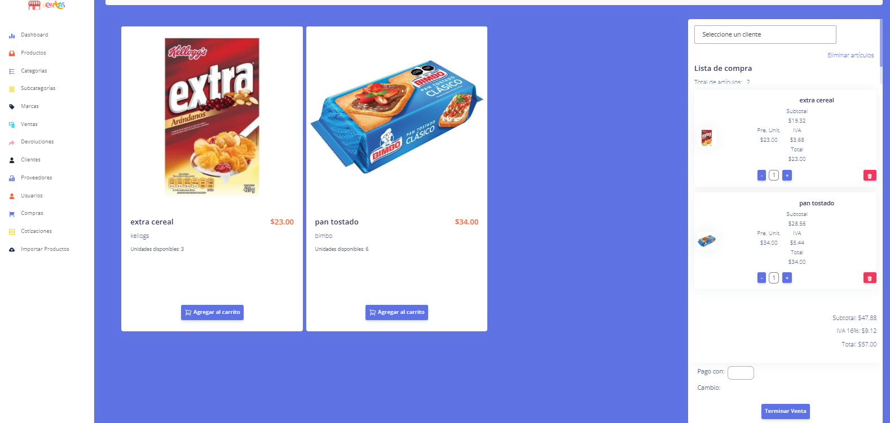
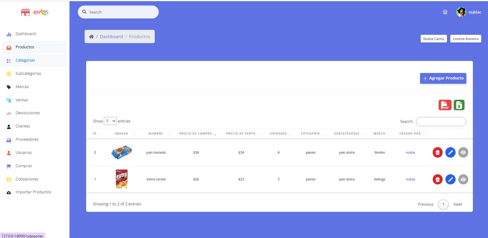
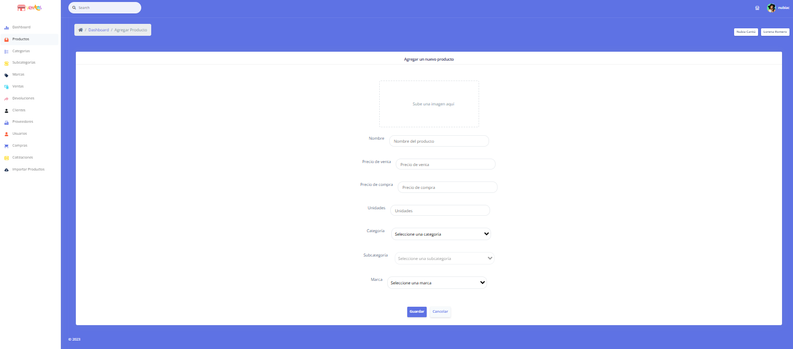
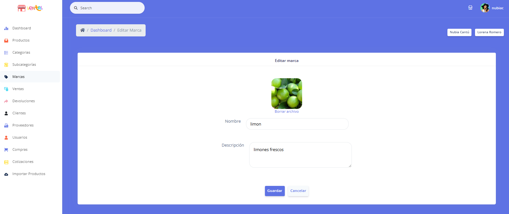
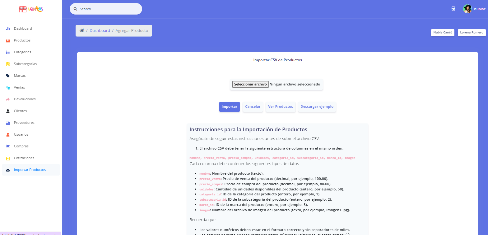
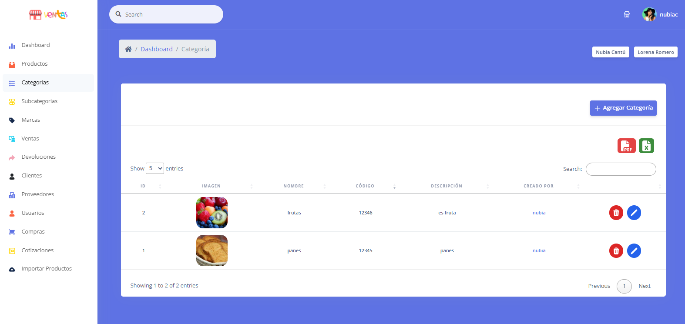
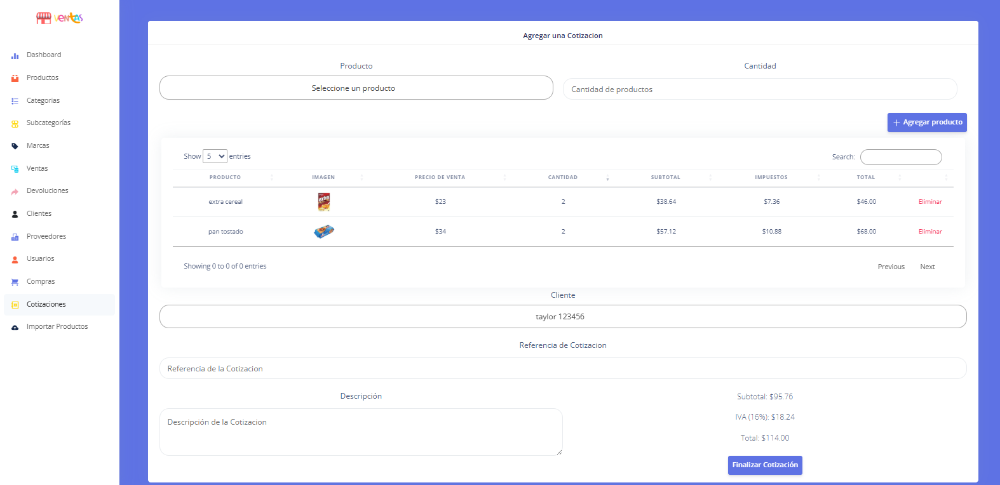
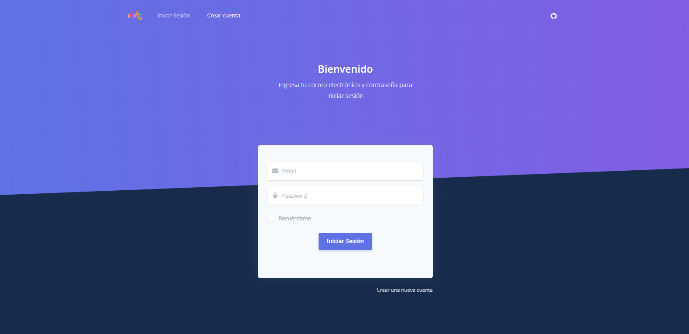
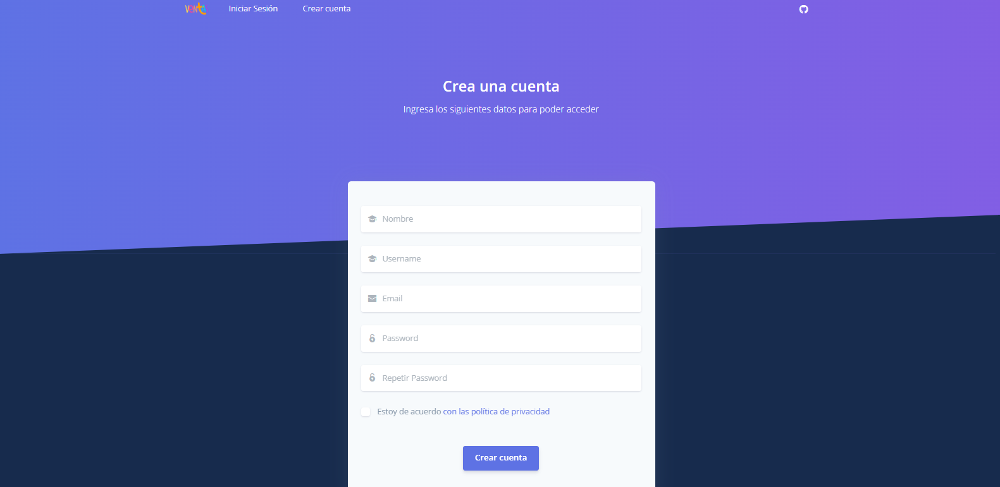

# 🛒 Point of Sale (POS) System

A full-featured academic Point of Sale (POS) system designed to simulate a real supermarket management environment.

This project includes both an **administrative panel** and a **customer-facing store interface**, covering the complete business workflow from product management to sales and reporting.

It was built to strengthen backend logic, database relationships, and full-stack web development skills using Laravel and modern web technologies.

---

## ⚙️ Main Modules

- Product Management  
- Brands Management  
- Users & Roles  
- Customers  
- Categories & Subcategories  
- Suppliers  
- Purchases  
- Quotes (Quotations)  
- Sales System  
- Admin Dashboard  
- Online Store (Shopping Interface)

---

## 📸 Screenshots

### 🛒 Dashboard

---

### 💰 Sales Module (Store Interface)

  
  

---

### 📦 Product Management

  
  
  

---

### 📥 Product Import

---

### 📂 Categories Management

---

### 🧾 Quotations Module

---

### 🔐 Authentication

  
  

---

## 🚀 Project Purpose

This project was developed as an academic exercise to simulate a real-world retail system.  
It focuses on:

- Clean MVC architecture  
- Database relationships and integrity  
- Role-based access control  
- Full CRUD operations  
- Real business workflow simulation  

---
